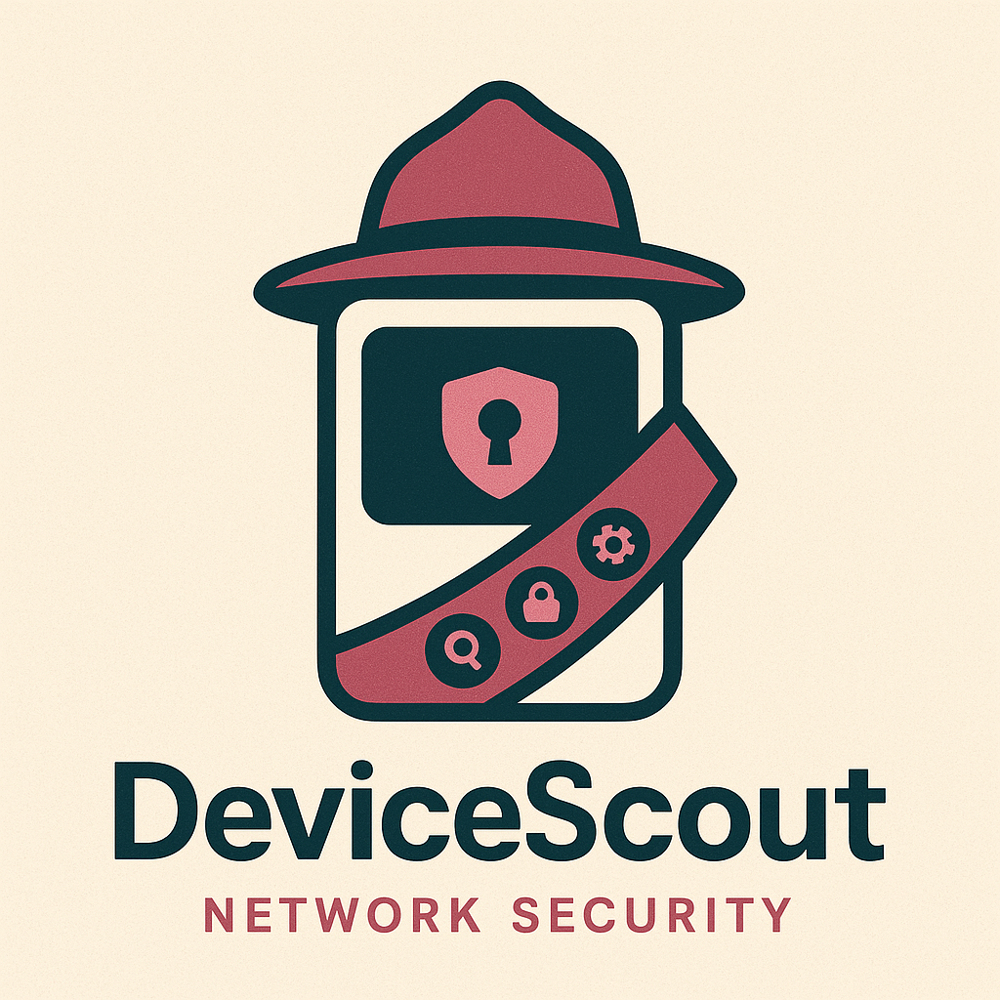

# DeviceScout
## Network Security Made Simple

DeviceScout is a comprehensive IoT device discovery and security assessment tool that helps users identify connected devices on their network and evaluate potential security vulnerabilities.



## 🌟 Features

- **Real-time Network Scanning** - Discover all devices connected to your network using Nmap
- **Device Identification** - Identify device types, manufacturers, and operating systems
- **Security Assessment** - Evaluate potential vulnerabilities and security risks
- **User-friendly Interface** - Clean, professional web interface accessible to non-technical users
- **Comprehensive Reporting** - Detailed device information and security recommendations

## 🏗️ Architecture

DeviceScout consists of two main components:

- **Frontend** - React-based web interface (`devicescout-frontend/`)
- **Backend** - Node.js API server with Nmap integration (`devicescout-backend/`)

## 📋 Prerequisites

### System Requirements
- **Node.js** (v14 or higher)
- **npm** (Node Package Manager)
- **Nmap** (Network scanning tool)

### Installing Nmap

**Windows:**
1. Download from: https://nmap.org/download.html#windows
2. Run the installer and ensure "Add Nmap to PATH" is checked
3. Restart your terminal after installation

**macOS:**
```bash
brew install nmap
```

**Linux (Ubuntu/Debian):**
```bash
sudo apt-get update
sudo apt-get install nmap
```

**Verify Installation:**
```bash
nmap --version
```

## 🚀 Quick Start

### 1. Clone the Repository

```bash
git clone https://github.com/YOUR_USERNAME/devicescout-frontend.git
cd devicescout-frontend
```

### 2. Backend Setup

```bash
# Navigate to backend directory
cd devicescout-backend

# Install dependencies
npm install

# Start the backend server
npm run dev
```

The backend will run on `http://localhost:3001`

### 3. Frontend Setup

```bash
# In a new terminal, navigate to frontend directory
cd devicescout-frontend

# Start the frontend server using Live Server (VS Code) or:
npx live-server
```

**Alternative Frontend Options:**
- **VS Code Live Server Extension:** Right-click `index.html` → "Open with Live Server"
- **Python:** `python -m http.server 8000`

## 🖥️ Usage

1. **Ensure both servers are running:**
   - Backend: `http://localhost:3001`
   - Frontend: `http://localhost:5500` (or your live server port)

2. **Open the frontend** in your web browser

3. **Click "Click to Scan"** to start network discovery

4. **Wait for scan completion** (30-60 seconds for typical home networks)

5. **View results:**
   - **Dashboard** - Overview of discovered devices and security score
   - **Devices** - Detailed list of all discovered devices
   - **Security** - Security assessment and recommendations

## 📡 API Endpoints

The backend provides the following endpoints:

| Endpoint | Description |
|----------|-------------|
| `GET /` | API status and health check |
| `GET /api/network-info` | Get current network information |
| `GET /api/test-nmap` | Test Nmap installation |
| `GET /api/scan` | Perform comprehensive network device scan |

## 🛠️ Development

### Project Structure

```
DeviceScout/
├── devicescout-frontend/
│   ├── index.html              # Main application file
│   ├── devicescout-logo.png    # Application logo
│   └── package.json
└── devicescout-backend/
    ├── server.js               # Express server
    ├── package.json
    ├── routes/
    │   └── network.js          # API routes
    └── utils/
        └── networkScanner.js   # Nmap integration
```

### Technology Stack

**Frontend:**
- HTML5 / CSS3
- JavaScript (ES6+)
- React 18 (via CDN)
- Responsive Design

**Backend:**
- Node.js
- Express.js
- Nmap (via node-nmap package)
- CORS enabled for cross-origin requests

### Testing the Setup

**Test Backend:**
```bash
# Check if backend is running
curl http://localhost:3001

# Test network detection
curl http://localhost:3001/api/network-info

# Test Nmap integration
curl http://localhost:3001/api/test-nmap
```

## 🔒 Security Considerations

- **Local Network Only** - DeviceScout scans your local network subnet
- **No External Data Transmission** - All scanning is performed locally
- **Admin Privileges** - Some advanced scanning features may require elevated permissions
- **Firewall Configuration** - Ensure your firewall allows local network communication

## 🐛 Troubleshooting

### Backend Issues

**"Nmap not found" errors:**
- Verify Nmap installation: `nmap --version`
- Ensure Nmap is in your system PATH
- Restart terminal after installation (especially on Windows)

**Port 3001 already in use:**
- Change the PORT in `server.js` or kill the process using port 3001
- Check what's using the port: `netstat -ano | findstr :3001` (Windows) or `lsof -i :3001` (Mac/Linux)

**Dependencies not found:**
- Run `npm install` in the backend directory
- Ensure Node.js is properly installed

### Frontend Issues

**Cannot connect to backend:**
- Verify backend is running on `http://localhost:3001`
- Check browser console for CORS errors
- Ensure both frontend and backend are running

**Live Server not working:**
- Try alternative: `python -m http.server 8000`
- Or open `index.html` directly in browser (may have CORS limitations)

### Scanning Issues

**Scan takes too long:**
- Normal scan time: 30-60 seconds for home networks
- Large corporate networks may take several minutes
- Check network connectivity and stability

**No devices found:**
- Ensure you're connected to a WiFi/Ethernet network
- Test with: `http://localhost:3001/api/network-info`
- Check backend console for detailed error messages

**Permission errors:**
- Some Nmap features require administrator/root privileges
- Run terminal as administrator (Windows) or use `sudo` (Mac/Linux)

## 📈 Performance Notes

- **Scan Speed:** Typical home networks (20-30 devices) scan in 30-60 seconds
- **Resource Usage:** Backend uses moderate CPU during scanning
- **Network Impact:** Scanning generates network traffic but is non-intrusive
- **Concurrent Scans:** Only one scan should run at a time

## 🤝 Contributing

1. Fork the repository
2. Create a feature branch: `git checkout -b feature-name`
3. Make your changes in the appropriate directory (`devicescout-frontend/` or `devicescout-backend/`)
4. Test your changes thoroughly
5. Commit with clear messages: `git commit -am 'Add feature: description'`
6. Push to your branch: `git push origin feature-name`
7. Submit a Pull Request

## 📄 License

MIT License - see LICENSE file for details

## 🚀 Future Enhancements

- **Advanced Security Scanning** - Port vulnerability analysis
- **Network Topology Visualization** - Interactive network maps  
- **Historical Data** - Track device changes over time
- **Security Compliance Reports** - Generate professional security assessments
- **Mobile Support** - Responsive design improvements
- **Multi-Network Support** - Scan multiple network segments

## 📞 Support

For issues and questions:
- **Create an issue** on GitHub with detailed error information
- **Check the troubleshooting section** above for common solutions
- **Include console output** (both frontend and backend) when reporting bugs

---

**DeviceScout** - Making network security accessible to everyone.